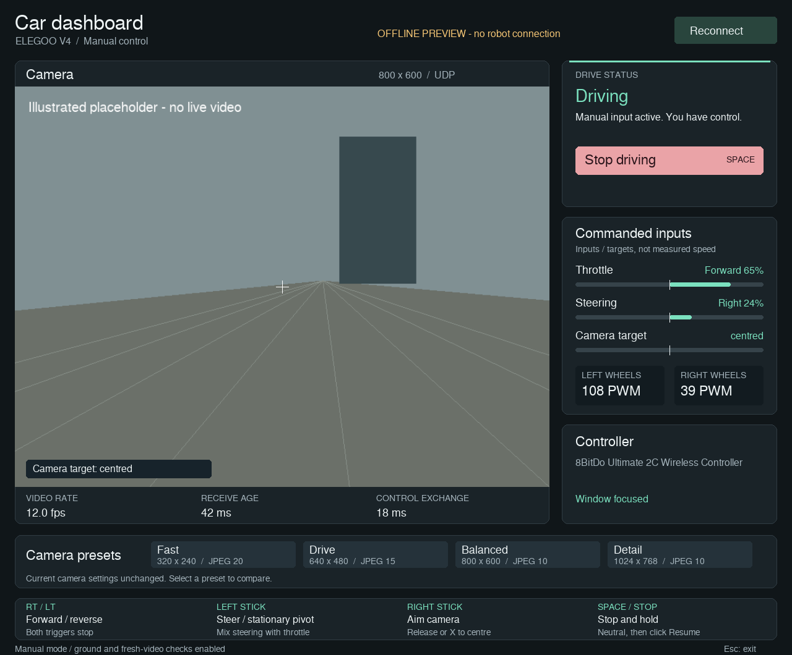

# ELEGOO Robot Car V4 — smooth driving and a desktop dashboard

This is a fork of [micdestefano/elegoo-robot-car4](https://github.com/micdestefano/elegoo-robot-car4),
originally developed by Michele De Stefano. It builds on that project's Python
client, ELEGOO firmware patches, router Wi-Fi support, and sensor access.

**This fork focuses on making the car pleasant to drive from a computer:** smooth
analogue gamepad control, a useful driving interface, and lower-latency video and
control. The priority is responsive manual driving rather than adding more
computer-vision or autonomous-driving features.



*The screenshot is the implemented dashboard in offline preview mode, with
illustrative values and a camera placeholder.*

## What this fork adds

- **Smooth gamepad driving:** right trigger for forward, left trigger for reverse,
  left stick for steering, and simultaneous driving and turning. Cubic response
  curves, a tuned minimum motor output, acceleration limiting, and extra steering
  authority while moving make fine adjustments easier. Both triggers together stop.
- **Camera control:** the right stick sets the pan target and releasing it centres
  the camera. Servo firmware changes address idle twitch and pulse cutoff.
- **A proper desktop dashboard:** a large camera view, clear driving/blocking
  status, command indicators, controller/focus state, connection metrics, and a
  control guide. The window is resizable and preserves the camera's aspect ratio.
- **Lower-latency video:** a dedicated JPEG-over-UDP stream displays the newest
  complete frame instead of building up a queue. Stale video blocks driving.
- **More responsive control:** combined wheel/camera commands, a matched
  38400-baud UNO–ESP32 link, corrupt-reply handling, and a firmware motor-command
  lease. These changes substantially improved responsiveness on the tested car;
  there is no guaranteed latency figure for other networks or hardware.
- **Explicit Stop/Resume:** Space or the Stop button latches driving off. Release
  the driving controls, then click Resume. Recovery from lost focus, stale video,
  or control errors also requires neutral controls.

The indicators show requested inputs and acknowledged command targets, **not
measured vehicle speed or physical servo position**. Network calls are still
synchronous, so a control timeout can briefly stall the interface.

## Hardware and firmware

Development has used an older ELEGOO Smart Robot Car Kit V4.0 with a
SmartCar-Shield-V1.1, TB6612 motor driver, MPU6050-compatible IMU, UNO-compatible
main board, and an ESP32-WROVER camera board. The current gamepad is an
8BitDo Ultimate 2C Wireless using SDL's standard controller mapping.

**UDP video and analogue driving require this fork's matching firmware changes.**
Installing the Python client alone does not add those capabilities to stock
firmware. Confirm your board revision and preserve a stock-firmware rollback
before flashing. Firmware preparation scripts and overlays are included; private
Wi-Fi credentials, compiled images and flash backups are not.

Start with the [workspace and firmware notes](bringup/WORKSPACE.md),
[hardware review](bringup/docs/hardware-photo-review.md), and
[bring-up record](bringup/docs/bring-up-status.md). Historical notes include earlier
firmware versions; the current tested serial link uses **38400 baud**.

## Run the controller

With the Python environment installed and the matching firmware running:

```sh
elegoo-smartcar-control --robot-ip YOUR_ROBOT_IP --video udp --analogue-drive
```

The robot joins your router's Wi-Fi network. Use its assigned IP address and keep
the controller window focused. Escape closes the controller and requests Stop.
The dashboard is enabled by `--analogue-drive`; the original HTTP/legacy control
path is retained for compatibility. This fork's additions are in this repository;
the upstream PyPI package does not include them.

To inspect the interface **without connecting to a robot**:

```sh
elegoo-smartcar-control --dashboard-preview
```

Press 1, 2 or 3 to preview Ready, Driving or stale-video states. Try Stop/Space,
Resume and window resizing. See [dashboard usage](bringup/docs/dashboard/README.md).

### Nix development environment

The `bringup/` directory preserves the surrounding development workspace. To
recreate its layout in a new directory:

```sh
mkdir elegoo-car
cd elegoo-car
git clone https://github.com/simonalsn/elegoo-robot-car4.git upstream
cp -a upstream/bringup/. .
nix-shell
car-setup
```

This installs the Python environment; it does not configure or flash the boards.
The existing computer-vision dependencies, including Ultralytics/PyTorch, remain
and can make the first installation large. See [workspace notes](bringup/WORKSPACE.md)
for the layout and [original documentation](UPSTREAM_README.md) for upstream context.

## Development notes

- [Analogue mixing and tuning](bringup/docs/analogue-drive.md)
- [UDP video protocol](bringup/docs/udp-video.md)
- [Control-link recovery](bringup/docs/control-recovery.md)
- [Servo fixes](bringup/docs/servo-idle.md)
- [Dashboard controls and validation](bringup/docs/dashboard/README.md)

The current client has 117 passing tests, including mocked control faults,
Stop/Resume interlocks, UDP handling and dashboard resizing. Hardware observations
and limitations are recorded in the bring-up notes; automated tests do not replace
an attended driving check on another car.

Possible next steps include display toggles, calibrated vehicle-width and
turning-path overlays, removing unused vision dependencies, and keeping the GUI
responsive during network timeouts.

## Credits and license

Thanks to [Michele De Stefano](https://github.com/micdestefano/elegoo-robot-car4)
for the project this fork builds on, and to ELEGOO for the original robot firmware.
The upstream [MIT license](LICENSE) and attribution are retained. Third-party
libraries and vendor firmware retain their own licenses.
